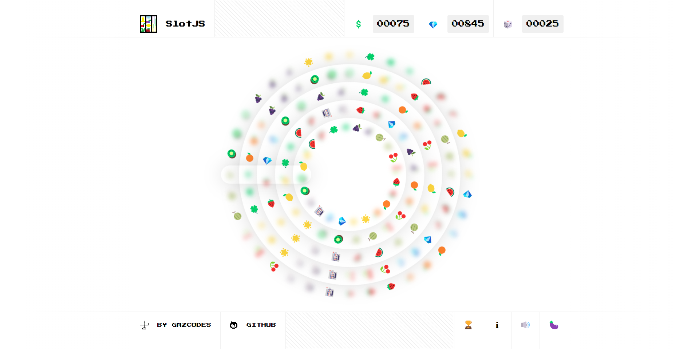

<h1 align="center">SlotJS</h1>

    🎰 Circular slot machine mobile-first SPA built using JavaScript, CSS variables and Emojis!

    🚀 Try it out at <a href="https://danziger.github.io/slotjs">danziger.github.io/slotjs</a>!

    🔊 Better with sound & vibration on.

 

    

 

Running It (Development)
------------------------

Take a look at `package.json`, the scripts are self-explanatory, but otherwise `npm install` and `npm start` work in `90%` of teh cases :D

The project will be accessible at http://localhost:8080/slotjs/.

 

Reporting a problem
-------------------

Don't hesitate to report any issue you find in this website/project by opening a new issue in this repository, but please make sure that problem hasn't been reported before by another user as an Issue or already appears in the [TODO file](./TODO).

 

Implementation Details, Limitations & Possible Improvements
-----------------------------------------------------------

### Not Random

Instead of generating random numbers to decide whether or not the slot machine is going to give a price, this one works in a more predictable way, where the ability of an user to stop it at the right spot actually influences their ability to get a prize, which I think is also more engaging and fair for them. Imagine, for example, the tension when having just one symbol left to get the jackpot, it's all on you:

    

### Group Rotation

We could rotate the reels container (`.sm__reelsContainer`) instead of the reels themselves (`.sm__reel`) so that we only need to rotate a single element with JS + another one with a CSS animation (the one that is stopping, if any) at a time:

    

The main advantage of this approach is that the main update rotation action will have the same work to do no matter how many reels we have, potentially producing lower and more predictable execution times for the `tick` method.

However, its drawbacks are that we have less control over the rotation, while with the current approach we could have different speeds and even accelerations for each reel and, most importantly, that when we stop a reel we have to move it outside the container, changing the DOM, which would make the stop action slower.

As rotating the reels is currently performing better (running at around `60 fps` even with a `6x` CPU slowdown) than stopping it (usually taking around `2` frames), mainly due to the costly `Recalculate Style` operation that the dynamically created animations trigger when a reel is stopped, I have decided not to implement this other approach. You know, _if it ain't broke..._

If this game had to run with a higher number of reels and that caused performance issues on some devices, we could do a performance test to compare both approaches.

### Rotate with Animations

A rotation animation could be used instead of manually calculating the rotation, which might be slightly more performant than the current approach.

However, when we stop a reel we would need to find out its angle from a rotation matrix and make sure the transition between the rotation and the stopping animations is smooth, while now we always know the current angle of all the reels. Also, we would have less control over the rotation, while with the current approach we could have different speeds and even accelerations for each reel.

### Zoom Effect

The zoom effect is a bit slow on Firefox and blurry on some iOS devices, while on Chrome the performance impact is there but it is not so noticeable. It would be simpler and way more performant in all browsers to show a bigger view of the current combination above the slot machine.

Anyway, I suspect the issue on iOS is because the scaling is done with GPU but no reflow is done after that, so we get a scaled up bitmap instead of a new one generated using the scaled up application, which should look sharper, as it does in other browsers.

This might be fixable using the `filter: none` or `-webkit-filter: blur(0px)` trick, but as I don' have an iOS device to test it, I didn't implement any fix.

### Blur Effect

Each cell in a reel is repeated a number of times, depending on the available space between one cell and the next one, with a blur effect and decreasing `opacity`, so that the animation looks smoother and without gaps between one cell and the next one but still makes it as obvious as possible where the real cell (the non-faded one) is.

However, it looks like `filter: blur(Npx)` is not using the GPU on Firefox, so it causes major performance issues. Therefore, this effect is not used on Firefox, where only `opacity` is changed.

 

Other ideas
-----------

### Special Symbols

We could have special symbols that give a random bonus: immediate prize, multipliers, slow-motion, wildcard symbol... and use the center of the slot machine to show that.

### Virtual Rooms

We could group players in "virtual rooms" according to some parameters like the time the spend to stop a reel, their recent average hit rate..., making sure they are on a similar skill level, and most of the money the spend will go to that room's jackpot, while a small percentage will go for fees.

Also, we could use WebSockets to make them all aware of the prices others on that room are getting to keep them more engaged in the game / competition.

 

Ongoing work
------------

This is just a weekend project I built a while back, so it won't be updated often. However, there's some ongoing work you can find in the [TODO file](./TODO).

 

Some other sites I've built
---------------------------

- **[GMZCODES](https://gmzcodes.com/)**

  👨‍💻 Dani Gamez's personal website PWA built using JavaScript, SCSS and HTML5.
  
- **[Stylophone.js](https://danziger.github.io/stylophonejs/)**

  🎹 The classic Stylophone, now in your phone and computer.

- **[Key.js](https://keyjs.dev)**

  ⌨ Press any key to get the JavaScript keyboard event event key, code, which, keyCode and more properties!

- **[Stars.js](https://danziger.github.io/starsjs/)**

  ✨ Generate a rotating galaxy in a canvas.
  
- **[Job.js](https://danziger.github.io/jobjs/)**

  💼 Sharable image summaries for your open positions: Share your jobs as an image on LinkedIn and Instagram to get a visibility boost and more applicants!

 

Author
------

Dani Gámez Franco

LinkedIn: https://www.linkedin.com/in/danigamezfranco/

Stack Overflow: https://stackoverflow.com/users/3723993/danziger
