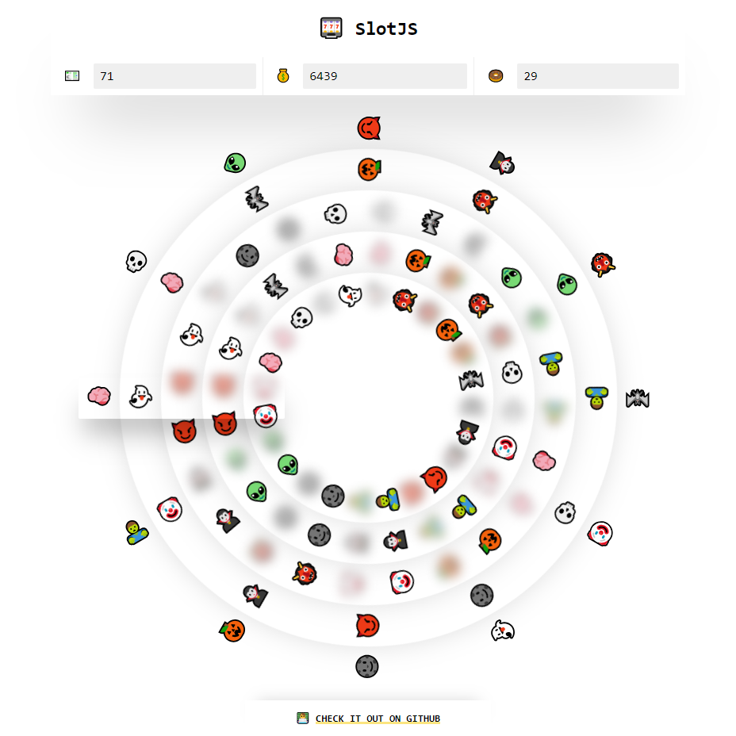

<section align="center">

SlotJS
======

🎰 Circular slot machine mobile-first SPA built using JavaScript, CSS variables and Emojis!

Try it out! 👉 https://danziger.github.io/slotjs

🔊 Better with sound on.

📱 Android only.

</section>

 
 

Running It (Development)
------------------------

Take a look at `package.json`, the scripts are self-explanatory.

TODO
----

- Check win.

- Hide (fade) shadows using CSS animations.

- Blur (fade) shadows using the `style` attribute instead of the `shadow-N` classes.

- Keep track of coins.

- Handle code TODOs.

- Add title, coins and footer.

Limitations & Possible Improvements
-----------------------------------

- We could rotate the reels container (`.sm__activeReels`) instead of the reels themselves (`.sm__reel`) so that we only need to rotate a single element with JS + another one with a CSS animation (the one that is stopping, if any) at a time. The drawback of this approach is that we have less control over the rotation (with the current approach we could have different speeds and accelerations for each reel) and when we stop a reel, we have to move it outside the container, so we change the DOM.

  We would have to do a performance test with each approach for a specific game configuration (number of reels, global VS individual speed/acceleration...).

- A rotation animation could be used instead of manually calculating the rotation, but then when we stop a reel, we would need to find out its angle from a rotation matrix and make sure the transition between the rotation and the stopping animation is smooth.

Author
------

Dani Gámez Franco

LinkedIn: https://www.linkedin.com/in/danigamezfranco/

Stack Overflow: https://stackoverflow.com/users/3723993/danziger
